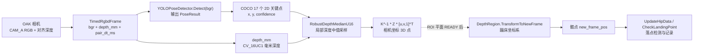
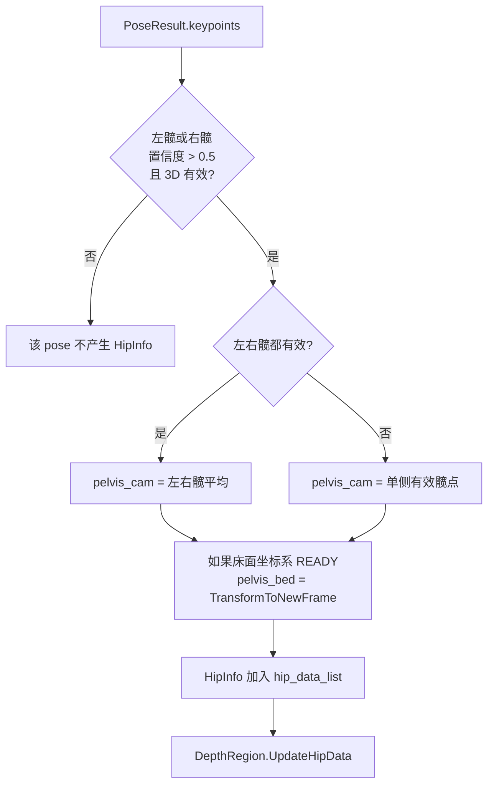
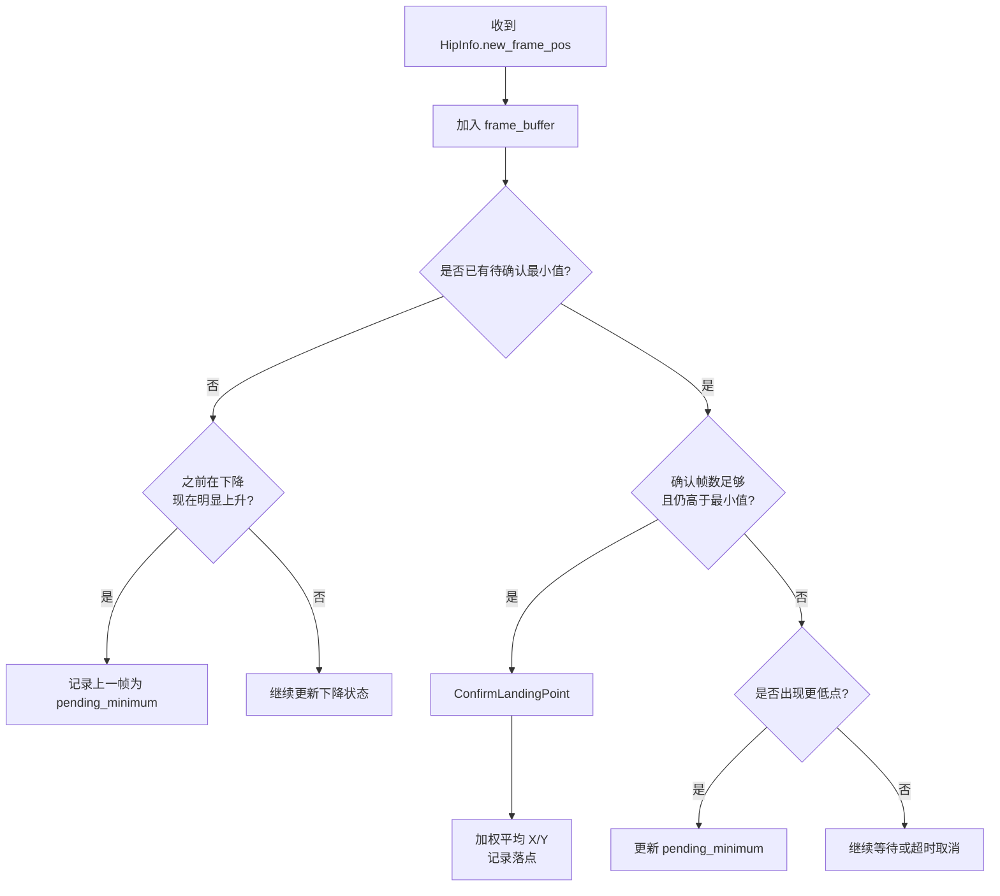

本页的目标是把新手最容易迷路的链路压缩成一个**最小闭环**：先用 OAK RGBD 采到一对已经配准的 RGB 图像和深度图，再用 YOLOv8 Pose 在 RGB 图像上得到 2D 人体关键点，然后用深度图和相机内参把关键点反投影到 3D，最后选取髋点轨迹在蹦床坐标系中的 Z 方向局部极小值作为落点候选并记录。这里不展开模型细节、DepthAI 管线细节、RANSAC 数学细节或完整业务算法，只建立你能从代码中追踪到的第一条闭环路径。Sources: [get_pose_oak_rgbd.cpp](get_pose_oak_rgbd.cpp#L639-L674), [get_pose_oak_rgbd.cpp](get_pose_oak_rgbd.cpp#L732-L753), [get_pose_oak_rgbd.cpp](get_pose_oak_rgbd.cpp#L840-L927), [app/depth_region.h](app/depth_region.h#L603-L675)

## 1. 架构考古假设：最小闭环由六个连续节点组成

从代码入口看，最小闭环不是“只有 YOLO 检测”，而是六个节点连续成立：**RGBD 采集成功 → 相机内参可用 → YOLO Pose 初始化成功 → 2D 关键点有足够置信度 → 深度采样有效 → 蹦床坐标系已建立后才能检测落点**。入口先启动 `OakRgbdCapture`，随后读取 CAM_A 的相机矩阵和逆矩阵，再初始化 `YOLOPoseDetector`，同时创建 `DepthRegion` 负责鼠标 ROI、蹦床坐标系和落点检测状态。Sources: [get_pose_oak_rgbd.cpp](get_pose_oak_rgbd.cpp#L639-L674), [app/oak_rgbd_capture.h](app/oak_rgbd_capture.h#L42-L56), [app/camera_intrinsics.h](app/camera_intrinsics.h#L1-L9)

下面的 Mermaid 图把这条链路画成新手可以按顺序验证的结构图：每个矩形都是代码中的一个实物对象或数据结构，箭头表示数据流向；虚线含义是“只有在 ROI 平面完成后才进入蹦床坐标系”。Sources: [app/oak_rgbd_capture.h](app/oak_rgbd_capture.h#L35-L40), [yolo_pose_detector.h](yolo_pose_detector.h#L49-L58), [get_pose_oak_rgbd.cpp](get_pose_oak_rgbd.cpp#L840-L927), [app/depth_region.h](app/depth_region.h#L508-L517)



## 2. 最小项目结构：只看闭环相关文件

如果只理解这条闭环，先关注 5 类文件即可：入口文件负责主循环，采集模块负责 RGBD 帧，检测模块负责 2D 姿态，深度/坐标模块负责 3D 转换和落点状态，运行状态模块负责录制开关和会话输出。Sources: [get_pose_oak_rgbd.cpp](get_pose_oak_rgbd.cpp#L9-L17), [app/oak_rgbd_capture.h](app/oak_rgbd_capture.h#L11-L40), [yolo_pose_detector.h](yolo_pose_detector.h#L15-L58), [app/depth_region.h](app/depth_region.h#L26-L49), [app/runtime_state.h](app/runtime_state.h#L7-L24)

```text
YOLO_rec/
├── get_pose_oak_rgbd.cpp        # OAK RGBD 主入口：采集、推理、3D 融合、落点更新
├── yolo_pose_detector.h/.cpp    # YOLOv8 Pose ONNX Runtime 检测器
├── pose_utils.h/.cpp            # COCO 骨架绘制与基础 3D 映射工具
└── app/
    ├── oak_rgbd_capture.h/.cpp  # OAK RGBD 帧采集、时间配对、相机内参
    ├── depth_utils.h/.cpp       # 局部鲁棒深度采样
    ├── depth_region.h           # ROI、蹦床坐标系、髋点轨迹、落点记录
    ├── camera_intrinsics.h      # 全局相机内参矩阵声明
    └── runtime_state.h/.cpp     # REC 开关与输出会话
```

## 3. 第一步：拿到“同一时刻”的 RGB 和深度

闭环的输入不是单张 RGB 图，而是 `TimedRgbdFrame`，其中包含 `timestamp_sec`、RGB 与深度的配对误差 `pair_dt_ms`、BGR 图像 `bgr`、以及毫米单位深度图 `depth_mm`。主循环通过 `oak_capture.TryGetLatest(rgbd)` 取最新一帧；如果暂时没有新帧，就只处理键盘退出并继续等待。Sources: [app/oak_rgbd_capture.h](app/oak_rgbd_capture.h#L35-L40), [get_pose_oak_rgbd.cpp](get_pose_oak_rgbd.cpp#L732-L747)

OAK 采集线程会把 RGB 和深度消息放入各自缓冲区，使用 `PopClosestPair` 按时间阈值配对，随后把 NV12 RGB 转成 BGR，把深度转成 `CV_16UC1`，并检查二者分辨率都等于配置的宽高；合格后才发布为 `TimedRgbdFrame`。Sources: [app/oak_rgbd_capture.cpp](app/oak_rgbd_capture.cpp#L392-L456), [app/oak_rgbd_capture.h](app/oak_rgbd_capture.h#L11-L33)

| 数据 | 代码字段 | 对新手的含义 | 最小闭环中的用途 |
|---|---|---|---|
| RGB 图像 | `TimedRgbdFrame::bgr` | OpenCV BGR 图像 | 输入 YOLO Pose |
| 深度图 | `TimedRgbdFrame::depth_mm` | `CV_16UC1`，单位毫米 | 给关键点查深度 |
| 时间戳 | `timestamp_sec` | RGB 帧时间 | 当前入口读取但未继续使用 |
| 配对误差 | `pair_dt_ms` | RGB 与深度时间差 | 显示为 Sync dt，辅助判断同步质量 |

Sources: [app/oak_rgbd_capture.h](app/oak_rgbd_capture.h#L35-L40), [get_pose_oak_rgbd.cpp](get_pose_oak_rgbd.cpp#L742-L747), [get_pose_oak_rgbd.cpp](get_pose_oak_rgbd.cpp#L809-L813)

## 4. 第二步：在 RGB 图上得到 2D 姿态

YOLO 检测器在入口中以模型路径、输入尺寸 640、检测置信度 0.5、NMS IoU 0.45、CUDA 开关 `true` 构造，然后调用 `Init()` 加载 ONNX Runtime Session；主循环中每拿到一张 RGB 图，就调用 `pose_detector.Detect(left_image)` 得到 `std::vector<PoseResult>`。Sources: [get_pose_oak_rgbd.cpp](get_pose_oak_rgbd.cpp#L661-L668), [get_pose_oak_rgbd.cpp](get_pose_oak_rgbd.cpp#L748-L758), [yolo_pose_detector.h](yolo_pose_detector.h#L60-L90)

`PoseResult` 是最小闭环里最重要的 2D 数据结构：它包含人体框 `bbox`、人体框置信度 `box_confidence`、17 个 COCO 关键点 `keypoints` 和可选人员 ID；每个 `KeyPoint` 记录图像坐标 `x/y`、关键点置信度 `confidence`，以及深度融合后可填写的 `pos3d`。Sources: [yolo_pose_detector.h](yolo_pose_detector.h#L15-L58)

YOLOv8 Pose 的输出在后处理里按 `[1, 56, 8400]` 解释，其中 56 等于 4 个框参数、1 个人体置信度和 17×3 个关键点数据；代码先按人体置信度过滤 proposal，再提取 17 个关键点，做 NMS，最后把 letterbox 后的坐标回映射到原始图像尺寸。Sources: [yolo_pose_detector.cpp](yolo_pose_detector.cpp#L215-L289), [yolo_pose_detector.cpp](yolo_pose_detector.cpp#L292-L381)

## 5. 第三步：把 2D 关键点变成相机坐标系 3D 点

主循环没有直接使用 `pose_utils.cpp` 中的批量 `MapPoseTo3D`，而是在 `get_pose_oak_rgbd.cpp` 内对每个 pose、每个关键点做显式融合：先要求关键点置信度至少 0.3，再检查像素坐标是否落在深度图范围内，然后调用 `RobustDepthMedianU16(depth_data, px, py, r=3, z_mm)` 在局部窗口取有效深度中值。Sources: [get_pose_oak_rgbd.cpp](get_pose_oak_rgbd.cpp#L854-L878), [app/depth_utils.h](app/depth_utils.h#L8-L11)

拿到深度 `Z` 后，代码构造齐次图像点 `[u, v, 1]^T`，使用 `cv_in_left_inv * Z * kp_img_cor` 得到相机坐标点；这里的 `cv_in_left_inv` 来自 OAK 校准读出的 CAM_A 内参矩阵逆矩阵。Sources: [get_pose_oak_rgbd.cpp](get_pose_oak_rgbd.cpp#L879-L896), [get_pose_oak_rgbd.cpp](get_pose_oak_rgbd.cpp#L646-L659), [app/oak_rgbd_capture.cpp](app/oak_rgbd_capture.cpp#L293-L306)

| 检查点 | 代码条件 | 不满足时的结果 |
|---|---|---|
| 图像存在 | `!left_image.empty()` | 不进入检测与融合 |
| pose 存在 | `!poses.empty()` | 没有关键点可融合 |
| 关键点可信 | `kp.confidence >= 0.3f` | 跳过该关键点 |
| 像素在深度图内 | `0 <= px < cols` 且 `0 <= py < rows` | 跳过该关键点 |
| 深度采样成功 | `RobustDepthMedianU16(...) == true` | 跳过该关键点 |
| 床面坐标系可用 | `depth_region.IsCoordSystemReady()` | 只保留相机坐标，不转床面坐标 |

Sources: [get_pose_oak_rgbd.cpp](get_pose_oak_rgbd.cpp#L748-L758), [get_pose_oak_rgbd.cpp](get_pose_oak_rgbd.cpp#L854-L897), [get_pose_oak_rgbd.cpp](get_pose_oak_rgbd.cpp#L846-L852)

## 6. 第四步：用四点 ROI 建立蹦床坐标系

落点不是直接在相机坐标系里记录，而是在“新坐标系”里记录；这个坐标系由 `DepthRegion` 通过鼠标四次点击蹦床 ROI 触发。`OnMouse` 会记录四个角点，第四次点击后把 `pending_roi_finalize_` 置为 true，后续在有深度数据时执行平面拟合。Sources: [app/depth_region.h](app/depth_region.h#L45-L81), [app/depth_region.h](app/depth_region.h#L106-L109)

ROI 完成后，代码在多边形内部抽样深度点，把每个有效深度像素反投影为相机坐标 3D 点；样本数不足 50 会失败，样本足够时先做 RANSAC 平面拟合，再用内点做最小二乘精修，最后调用 `BuildFrameFromPlane` 建立蹦床坐标系。Sources: [app/depth_region.h](app/depth_region.h#L300-L371)

当坐标系已建立，`TransformToNewFrame(point_cam)` 会先把相机坐标点减去床面坐标系原点，再使用 `rotation_matrix_` 的列向量形式完成旋转投影，输出新坐标系下的 `x/y/z`。Sources: [app/depth_region.h](app/depth_region.h#L374-L403), [app/depth_region.h](app/depth_region.h#L1210-L1233)

## 7. 第五步：选择髋点作为落点轨迹

最小闭环选择髋点而不是脚点作为轨迹输入：对每个 pose，代码要求左髋或右髋关键点置信度大于 0.5 且已成功反投影；如果左右髋都有效，就取二者 3D 坐标平均值作为 `pelvis_cam`，否则使用单侧有效髋点。Sources: [get_pose_oak_rgbd.cpp](get_pose_oak_rgbd.cpp#L899-L917)

随后代码构造 `DepthRegion::HipInfo`：写入人员编号、相机坐标 `camera_pos`，并在床面坐标系可用时写入 `new_frame_pos`；这些髋点数据被收集到 `hip_data_list`，作为后续落点检测唯一需要的输入。Sources: [get_pose_oak_rgbd.cpp](get_pose_oak_rgbd.cpp#L919-L927), [get_pose_oak_rgbd.cpp](get_pose_oak_rgbd.cpp#L998-L1003)



## 8. 第六步：在髋点 Z 曲线上确认落点

`UpdateHipData` 会先处理丢帧：如果当前没有髋点，连续缺失达到阈值后重置落点趋势状态；如果有髋点，它会选择稳定跟踪目标，保存当前相机坐标，并在 `has_new_frame` 为 true 时对新坐标系 3D 点做 EMA 滤波，再把 Z 值加入历史曲线。Sources: [app/depth_region.h](app/depth_region.h#L603-L675)

落点检测发生在 `CheckLandingPoint`：它把当前帧的 `x/y/z` 和时间戳加入缓冲区，维护固定大小窗口；当系统先观察到明显下降，再观察到上升，并且上升幅度超过阈值的一半时，就把前一帧登记为“待确认最小值”。Sources: [app/depth_region.h](app/depth_region.h#L677-L760)

待确认最小值不会立即输出；代码会继续等待若干确认帧，如果当前 Z 仍高于候选最小值并满足确认帧数，就调用 `ConfirmLandingPoint()`。确认阶段会在候选点附近重新寻找实际最小 Z，并在窗口内按 `1 / (|Z_i - Z_min| + epsilon)` 对 X/Y 加权平均，得到最终落点坐标。Sources: [app/depth_region.h](app/depth_region.h#L722-L747), [app/depth_region.h](app/depth_region.h#L769-L852)



## 9. 最小运行交互：新手只需要关注四类动作

入口启动后会打印控制说明：鼠标在 YOLO 窗口点击四个蹦床角点建立 ROI；`r` 切换落点录制开关；`c` 清空缓存落点；`s` 保存落点 CSV；`+/-` 调整 Z 阈值，`[/]` 调整加权窗口半径。这里的交互是最小闭环的“人工开关”：没有 ROI 就没有床面坐标系，没有 REC 开关就不会把检测到的落点入库。Sources: [get_pose_oak_rgbd.cpp](get_pose_oak_rgbd.cpp#L691-L706), [app/depth_region.h](app/depth_region.h#L854-L881), [app/runtime_state.h](app/runtime_state.h#L7-L24)

| 动作 | 键/鼠标 | 闭环影响 |
|---|---|---|
| 建立蹦床坐标系 | 鼠标点击 4 个角点 | 让髋点从相机坐标转入床面坐标 |
| 开始/停止落点入库 | `r` | 控制 `record_enabled` |
| 清空落点 | `c` | 清空已缓存落点并重置状态 |
| 保存落点 | `s` | 输出 `landing_points.csv` |
| 调整 Z 阈值 | `+ / -` | 改变局部极小值触发灵敏度 |
| 调整加权窗口 | `[ / ]` | 改变落点 X/Y 加权平均帧范围 |

Sources: [get_pose_oak_rgbd.cpp](get_pose_oak_rgbd.cpp#L691-L706), [app/depth_region.h](app/depth_region.h#L888-L918), [app/depth_region.h](app/depth_region.h#L920-L963)

## 10. 闭环输出：屏幕叠加、控制台日志、CSV 文件

闭环运行时会在显示图上画出 2D 姿态、FPS、推理耗时、RGB/深度同步误差、检测到的人数，并在 ROI 建立后绘制坐标轴和 ROI 边框；右上角面板还显示 REC 状态、落点数量和最近一次落点坐标。Sources: [get_pose_oak_rgbd.cpp](get_pose_oak_rgbd.cpp#L787-L823), [get_pose_oak_rgbd.cpp](get_pose_oak_rgbd.cpp#L1034-L1040), [get_pose_oak_rgbd.cpp](get_pose_oak_rgbd.cpp#L1171-L1197)

当落点被确认时，`RecordLandingPoint` 会根据 `g_runtime_flags.record_enabled` 决定是否把落点加入 `landing_points_`；保存时，`FlushLandingPoints` 写出 `landing_points.csv`，表头为 `id,t_ms,new_frame_x,new_frame_y,new_frame_z`。Sources: [app/depth_region.h](app/depth_region.h#L854-L881), [app/depth_region.h](app/depth_region.h#L933-L963)

## 11. 新手验收清单：按数据是否流动排查

最小闭环的验收顺序应该从输入向输出推进：先确认 OAK RGBD 帧能被配对发布，再确认 YOLO 能输出 pose，再确认关键点能采到有效深度，再确认四点 ROI 后 `coord_system_ready_` 成立，最后观察 `UpdateHipData` 是否收到带 `new_frame_pos` 的髋点并触发落点确认。Sources: [app/oak_rgbd_capture.cpp](app/oak_rgbd_capture.cpp#L423-L456), [get_pose_oak_rgbd.cpp](get_pose_oak_rgbd.cpp#L752-L758), [get_pose_oak_rgbd.cpp](get_pose_oak_rgbd.cpp#L854-L927), [app/depth_region.h](app/depth_region.h#L508-L517), [app/depth_region.h](app/depth_region.h#L603-L675)

| 现象 | 优先检查的代码位置 | 判断标准 |
|---|---|---|
| 没有画面 | `OakRgbdCapture::TryGetLatest` | 是否返回 `true` 并填充 `bgr/depth_mm` |
| 有画面但无骨架 | `YOLOPoseDetector::Detect` | 是否返回非空 `poses` |
| 有骨架但无 3D | 深度采样与反投影循环 | 关键点置信度、像素范围、深度中值是否通过 |
| 有 3D 但无床面坐标 | `IsCoordSystemReady` | 是否完成四点 ROI 和床面平面建立 |
| 有床面坐标但无落点 | `CheckLandingPoint` | Z 曲线是否出现下降后上升并超过阈值 |
| 检测到但 CSV 空 | `RecordLandingPoint` | `record_enabled` 是否为 true |

Sources: [app/oak_rgbd_capture.cpp](app/oak_rgbd_capture.cpp#L233-L243), [yolo_pose_detector.cpp](yolo_pose_detector.cpp#L170-L213), [get_pose_oak_rgbd.cpp](get_pose_oak_rgbd.cpp#L854-L897), [app/depth_region.h](app/depth_region.h#L508-L517), [app/depth_region.h](app/depth_region.h#L687-L760), [app/depth_region.h](app/depth_region.h#L854-L881)

## 12. 下一步阅读路径

如果你刚刚理解了本页的闭环，建议下一步先读 [实时窗口、鼠标 ROI 与键盘交互指南](6-shi-shi-chuang-kou-shu-biao-roi-yu-jian-pan-jiao-hu-zhi-nan)，因为闭环是否进入“床面坐标系”取决于窗口中的四点 ROI 操作；随后读 [整体数据流：相机采集、姿态推理、深度融合与业务判断](9-zheng-ti-shu-ju-liu-xiang-ji-cai-ji-zi-tai-tui-li-shen-du-rong-he-yu-ye-wu-pan-duan) 建立全局视角，再按兴趣进入 [YOLOv8 Pose 的 ONNX Runtime 推理流程](12-yolov8-pose-de-onnx-runtime-tui-li-liu-cheng)、[深度图单位、相机内参与像素反投影](16-shen-du-tu-dan-wei-xiang-ji-nei-can-yu-xiang-su-fan-tou-ying)、[四点 ROI、RANSAC 平面拟合与床面坐标系构建](18-si-dian-roi-ransac-ping-mian-ni-he-yu-chuang-mian-zuo-biao-xi-gou-jian) 和 [髋点轨迹建模与落点检测状态机](21-kuan-dian-gui-ji-jian-mo-yu-luo-dian-jian-ce-zhuang-tai-ji)。Sources: [get_pose_oak_rgbd.cpp](get_pose_oak_rgbd.cpp#L691-L706), [app/depth_region.h](app/depth_region.h#L45-L81), [get_pose_oak_rgbd.cpp](get_pose_oak_rgbd.cpp#L840-L927), [app/depth_region.h](app/depth_region.h#L677-L760)