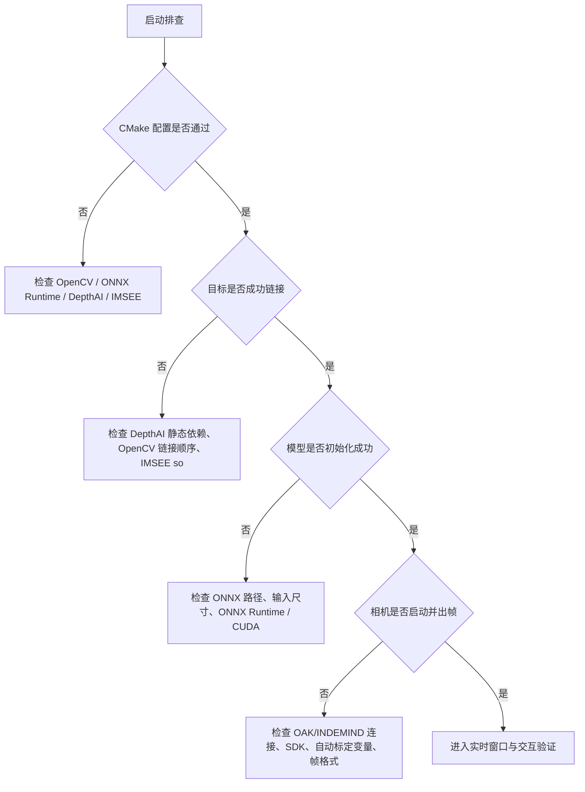
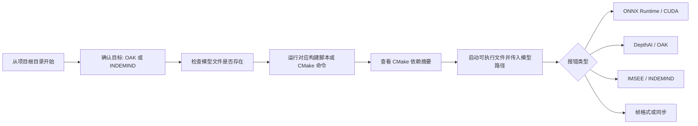

本页用于把项目中最容易阻断“能编译、能加载模型、能连上相机”的问题压缩成一套可执行的排查路径。当前项目存在 **OAK RGBD 新目标** 与 **INDEMIND 旧目标** 两条入口：默认 CMake 选项构建 OAK RGBD，INDEMIND 目标默认关闭；两个目标共享 OpenCV、ONNX Runtime、YOLO 推理模块与部分 app 工程模块，但相机 SDK 依赖不同。Sources: [CMakeLists.txt](CMakeLists.txt#L10-L14), [CMakeLists.txt](CMakeLists.txt#L541-L568), [CMakeLists.txt](CMakeLists.txt#L625-L643)

## 先建立排查假设：失败通常发生在三层边界

从第一性原理看，本项目启动失败通常不是“算法逻辑失败”，而是发生在三类工程边界：**构建期依赖发现**、**运行期模型会话创建**、**相机采集链路启动**。构建期由 CMake 查找 OpenCV、ONNX Runtime、DepthAI 或 IMSEE SDK；运行期由 `YOLOPoseDetector::Init()` 创建 ONNX Runtime session 并读取输入输出形状；相机链路则由 OAK 的 `OakRgbdCapture::Start()` 或 INDEMIND 的 `CIMRSDK::Init()` 决定是否能进入主循环。Sources: [CMakeLists.txt](CMakeLists.txt#L58-L123), [CMakeLists.txt](CMakeLists.txt#L447-L505), [yolo_pose_detector.cpp](yolo_pose_detector.cpp#L53-L117), [get_pose_oak_rgbd.cpp](get_pose_oak_rgbd.cpp#L639-L668), [get_pose_indemind_left.cpp](get_pose_indemind_left.cpp#L684-L727)



上图的关键判断顺序与代码路径一致：CMake 首先输出构建配置与依赖状态，然后目标程序在 main 中选择默认模型路径，随后启动相机并初始化 YOLO detector；OAK 入口在读取 CAM_A 内参失败时会直接退出，INDEMIND 入口在 SDK 初始化失败时会直接退出。Sources: [CMakeLists.txt](CMakeLists.txt#L663-L688), [get_pose_oak_rgbd.cpp](get_pose_oak_rgbd.cpp#L605-L668), [get_pose_indemind_left.cpp](get_pose_indemind_left.cpp#L675-L727)

## 快速定位：先分清你正在构建哪个目标

| 排查维度 | OAK RGBD 新目标 | INDEMIND 旧目标 |
|---|---|---|
| CMake 开关 | `BUILD_OAK_RGBD_TARGET=ON` | `BUILD_INDEMIND_TARGET=ON` |
| 默认状态 | 开启 | 关闭 |
| 可执行文件名 | `yolo_pose_oak_rgbd` | `yolo_pose_indemind_left` |
| 相机依赖 | DepthAI / OAK | IMSEE SDK / `libindemind.so` |
| 默认模型 | `models/yolov8n-pose-640.onnx` | `models/yolov8m-pose-1280.onnx` |
| 推理输入尺寸 | 640 | 1280 |

目标选择错误是最常见的误判来源：仓库根 CMake 默认 `BUILD_OAK_RGBD_TARGET=ON`、`BUILD_INDEMIND_TARGET=OFF`，因此直接按默认配置更接近 OAK RGBD 链路；如果要构建旧 INDEMIND 目标，必须显式打开 `BUILD_INDEMIND_TARGET`，并且本地 `include/imrsdk.h` 与 `lib/libindemind.so` 必须存在。Sources: [CMakeLists.txt](CMakeLists.txt#L10-L14), [CMakeLists.txt](CMakeLists.txt#L487-L505), [CMakeLists.txt](CMakeLists.txt#L625-L654)

## 推荐排查流程



这个流程刻意先检查目标与模型，再进入构建，因为 OAK 入口与 INDEMIND 入口的默认模型不同；OAK main 默认使用 `models/yolov8n-pose-640.onnx`，INDEMIND main 默认使用 `models/yolov8m-pose-1280.onnx`，两者分别以 640 与 1280 作为 `YOLOPoseDetector` 的输入尺寸。Sources: [get_pose_oak_rgbd.cpp](get_pose_oak_rgbd.cpp#L605-L608), [get_pose_oak_rgbd.cpp](get_pose_oak_rgbd.cpp#L661-L664), [get_pose_indemind_left.cpp](get_pose_indemind_left.cpp#L675-L678), [get_pose_indemind_left.cpp](get_pose_indemind_left.cpp#L720-L723)

## OAK RGBD 构建失败：优先检查 DepthAI 与 CMake 前缀

OAK 构建脚本默认使用 `/home/chris4/workspace/from_git/depthai-core` 作为 `DEPTHAI_CORE_ROOT`，并把 `build_no_dcl` 作为 `DEPTHAI_CORE_BUILD_DIR`；脚本还会把 depthai-core 的 `_deps`、`vcpkg_installed` 以及调用者已有的 `CMAKE_PREFIX_PATH` 拼接进 `DEPTHAI_PREFIX_PATH`，再传给 CMake。Sources: [build_oak_rgbd_linux.sh](build_oak_rgbd_linux.sh#L4-L12), [build_oak_rgbd_linux.sh](build_oak_rgbd_linux.sh#L23-L61), [build_oak_rgbd_linux.sh](build_oak_rgbd_linux.sh#L63-L77)

如果 CMake 报找不到 DepthAI，应先核对 `DEPTHAI_CORE_ROOT` 与 `DEPTHAI_CORE_BUILD_DIR` 是否指向本机实际 depthai-core 源码与构建目录；CMake 会先在 `DEPTHAI_CORE_BUILD_DIR`、其 install 子目录、lib/cmake/depthai 子目录，以及 `DEPTHAI_CORE_ROOT/build` 的对应位置查找 `depthai` package，找不到才退回 `find_package(depthai CONFIG REQUIRED)`。Sources: [CMakeLists.txt](CMakeLists.txt#L447-L463)

如果 CMake 找到了 DepthAI 但链接阶段出现 protobuf、Abseil、utf8 或 dynamic calibration 相关符号问题，应优先看 CMake 输出中是否出现“Final protobuf/utf8/absl static link group”或“Dynamic calibration link libraries for DepthAI”；项目已经把 DepthAI 静态构建常见的 protobuf/absl/utf8 依赖移动到最终 linker group，并尝试为 dynamic calibration 创建兼容 target。Sources: [CMakeLists.txt](CMakeLists.txt#L328-L396), [CMakeLists.txt](CMakeLists.txt#L399-L445), [CMakeLists.txt](CMakeLists.txt#L472-L484)

## OAK RGBD 推荐构建与启动命令

| 操作 | 命令 |
|---|---|
| 设置 DepthAI 自动标定变量 | `export DEPTHAI_AUTOCALIBRATION=OFF` |
| 脚本构建 | `./build_oak_rgbd_linux.sh` |
| 脚本内 CMake 目标 | `-DBUILD_OAK_RGBD_TARGET=ON -DBUILD_INDEMIND_TARGET=OFF` |
| 默认输出 | `build_agent_out/yolo_pose_oak_rgbd` |
| 默认运行 | `DEPTHAI_AUTOCALIBRATION=OFF ./build_agent_out/yolo_pose_oak_rgbd models/yolov8n-pose-640.onnx` |

脚本构建完成后打印的运行命令指向 `build_agent_out/yolo_pose_oak_rgbd`，并使用 `models/yolov8n-pose-640.onnx`；CMakeLists 也在配置摘要中打印相同的 OAK 构建与运行提示。Sources: [build_oak_rgbd_linux.sh](build_oak_rgbd_linux.sh#L79-L84), [CMakeLists.txt](CMakeLists.txt#L682-L687)

## INDEMIND 构建失败：确认旧 SDK 文件确实存在

INDEMIND 构建脚本会检查当前目录是否有 `CMakeLists.txt`，再检查 CMake、G++、OpenCV、ONNX Runtime、`include/` 与 `lib/libindemind.so`；其中 `lib/libindemind.so` 缺失会直接作为错误退出。Sources: [build_linux.sh](build_linux.sh#L32-L52), [build_linux.sh](build_linux.sh#L54-L86), [build_linux.sh](build_linux.sh#L88-L107)

需要注意一个仓库内可验证的不一致点：`build_linux.sh` 检查的是 `models/yolov8n-pose.onnx`，但仓库当前 `models/` 下可见的是 `yolov8m-pose-1280.onnx`、`yolov8n-pose-1280.onnx` 与 `yolov8n-pose-640.onnx`，而 INDEMIND main 的默认模型是 `models/yolov8m-pose-1280.onnx`。因此旧脚本的模型检查警告不等价于程序实际默认模型缺失，应以 main 中默认路径或你显式传入的路径为准。Sources: [build_linux.sh](build_linux.sh#L99-L107), [get_pose_indemind_left.cpp](get_pose_indemind_left.cpp#L675-L678)

## ONNX Runtime 找不到：按查找顺序修复

CMake 会优先在 Conda 环境中寻找 ONNX Runtime：如果存在 `CONDA_PREFIX`，会在 `${CONDA_PREFIX}/include/onnxruntime`、`${CONDA_PREFIX}/include` 与 `${CONDA_PREFIX}/lib` 查找头文件和库；如果没有找到，再查 `/usr/local/include/onnxruntime`、`/usr/include/onnxruntime`、项目内 `onnxruntime/include` 以及对应 lib 路径。Sources: [CMakeLists.txt](CMakeLists.txt#L73-L115)

如果最终仍未找到，CMake 会报 `ONNX Runtime not found. Set ONNXRUNTIME_INCLUDE_DIR and ONNXRUNTIME_LIB manually.`；因此修复动作只有两类：要么让 Conda 环境或系统路径中确实存在 ONNX Runtime 头文件与库，要么在 CMake 配置时显式传入 `ONNXRUNTIME_INCLUDE_DIR` 与 `ONNXRUNTIME_LIB`。Sources: [CMakeLists.txt](CMakeLists.txt#L117-L123)

运行期如果 `YOLOPoseDetector::Init()` 失败，代码会捕获 `Ort::Exception` 并打印 `ONNX Runtime error:`；初始化流程会创建 session、检查输入节点数量必须为 1、输出节点数量必须为 1，并打印输入输出名称与形状。Sources: [yolo_pose_detector.cpp](yolo_pose_detector.cpp#L53-L117)

## CUDA 相关问题：先确认是否已经自动回退 CPU

两个入口都以 `use_cuda=true` 构造 `YOLOPoseDetector`；构造函数会尝试追加 CUDA execution provider，如果 ONNX Runtime CUDA provider 配置失败，会打印 warning 并将 `use_cuda_` 置为 false，随后继续使用 CPU 路径。Sources: [get_pose_oak_rgbd.cpp](get_pose_oak_rgbd.cpp#L661-L664), [get_pose_indemind_left.cpp](get_pose_indemind_left.cpp#L720-L723), [yolo_pose_detector.cpp](yolo_pose_detector.cpp#L31-L46)

因此，看到 `Warning: Failed to configure CUDA` 并不必然代表程序必须退出；真正阻断启动的是随后 session 创建失败、模型文件不可读、模型结构不符合期望，或 ONNX Runtime 本身缺失。Sources: [yolo_pose_detector.cpp](yolo_pose_detector.cpp#L31-L46), [yolo_pose_detector.cpp](yolo_pose_detector.cpp#L53-L117)

## 模型加载失败：检查路径、尺寸与输出结构

| 入口 | 默认模型路径 | detector 输入尺寸 | 典型修复 |
|---|---:|---:|---|
| OAK RGBD | `models/yolov8n-pose-640.onnx` | 640 | 使用默认 640 模型，或启动时显式传入可读 ONNX 路径 |
| INDEMIND | `models/yolov8m-pose-1280.onnx` | 1280 | 使用默认 1280 模型，或传入与输入尺寸匹配的模型 |

OAK 入口允许通过第一个命令行参数覆盖模型路径，INDEMIND 入口也使用同样模式；如果路径错误，失败会出现在 `YOLOPoseDetector::Init()` 创建 ONNX session 的阶段，而不是 CMake 阶段。Sources: [get_pose_oak_rgbd.cpp](get_pose_oak_rgbd.cpp#L602-L608), [get_pose_oak_rgbd.cpp](get_pose_oak_rgbd.cpp#L661-L668), [get_pose_indemind_left.cpp](get_pose_indemind_left.cpp#L672-L678), [get_pose_indemind_left.cpp](get_pose_indemind_left.cpp#L720-L727)

当前推理后处理按 YOLOv8-pose 输出结构读取：注释标明格式为 `[1, 56, 8400]`，其中 56 表示 bbox 4 项、confidence 1 项与 17 个关键点的 3 项数据；代码从 `output_shape_[2]` 读取 proposal 数，从 `output_shape_[1]` 读取元素数，并按该布局转置与解析。Sources: [yolo_pose_detector.cpp](yolo_pose_detector.cpp#L215-L235), [yolo_pose_detector.cpp](yolo_pose_detector.cpp#L237-L279)

## OAK 相机连接失败：看启动阶段与帧格式阶段

OAK 采集启动时会在采集线程中强制设置 `DEPTHAI_AUTOCALIBRATION=OFF`，创建 `dai::Device`，打印 USB speed 与已连接相机列表，然后读取 CAM_A 在 640x400 下的内参矩阵；如果这一阶段抛异常，`Start()` 会返回 false，main 会打印 `ERROR: Failed to start OAK RGBD capture:` 并退出。Sources: [app/oak_rgbd_capture.cpp](app/oak_rgbd_capture.cpp#L280-L306), [app/oak_rgbd_capture.cpp](app/oak_rgbd_capture.cpp#L462-L474), [get_pose_oak_rgbd.cpp](get_pose_oak_rgbd.cpp#L639-L644)

OAK 管线固定使用 CAM_A 作为 RGB，CAM_B 与 CAM_C 作为 stereo，帧同步模式为 CAM_B OUTPUT master、CAM_A/C INPUT；RGB 输出请求为 640x400 NV12，StereoDepth 输出对齐到 CAM_A，并通过 host ImageFilters 输出深度。Sources: [app/oak_rgbd_capture.cpp](app/oak_rgbd_capture.cpp#L308-L370), [app/oak_rgbd_capture.cpp](app/oak_rgbd_capture.cpp#L371-L388)

如果程序能启动但一直等不到画面，应关注 RGB 与 depth 是否成功配对：采集线程分别从 RGB queue 与 depth queue 拉取消息，使用 `pair_threshold_ms` 做最近时间戳匹配；main 在没有拿到最新帧时只执行 `cv::waitKey(1)` 并继续等待。Sources: [app/oak_rgbd_capture.cpp](app/oak_rgbd_capture.cpp#L399-L431), [get_pose_oak_rgbd.cpp](get_pose_oak_rgbd.cpp#L728-L740)

如果终端出现 `OAK RGB frame has unexpected format` 或 `OAK depth frame has unexpected format`，说明已收到帧但不满足代码硬约束：RGB 必须是 `640x400`、`CV_8UC3`，depth 必须是 `640x400`、`CV_16UC1`。Sources: [app/oak_rgbd_capture.cpp](app/oak_rgbd_capture.cpp#L433-L448)

## INDEMIND 相机连接失败：看 SDK 初始化返回值

INDEMIND 入口创建 `CIMRSDK`，配置 `bSlam=false`、`imgResolution=IMG_1280`、`imgFrequency=50`、`imuFrequency=0`，随后调用 `m_pSDK->Init(config)`；如果返回 false，程序打印 `ERROR: Failed to initialize INDEMIND SDK!`，释放 SDK 对象并退出。Sources: [get_pose_indemind_left.cpp](get_pose_indemind_left.cpp#L684-L698)

SDK 初始化成功后，程序会从 `GetModuleParams()` 读取左相机 1280x800 标定参数，构造 `cv_in_left` 与逆矩阵，并打印 fx、fy、cx、cy；如果你在这一步之前失败，问题属于 SDK/设备连接层，而不是 YOLO 模型层。Sources: [get_pose_indemind_left.cpp](get_pose_indemind_left.cpp#L700-L718)

## 常见症状对照表

| 症状 | 最可能边界 | 直接证据 | 处理动作 |
|---|---|---|---|
| `ONNX Runtime not found` | CMake 依赖发现 | CMake fatal error | 传入 `ONNXRUNTIME_INCLUDE_DIR` 与 `ONNXRUNTIME_LIB`，或修复 Conda/系统安装 |
| `Failed to initialize YOLO Pose Detector!` | 模型或 ONNX Runtime session | main 在 `pose_detector.Init()` 后退出 | 检查模型路径、ONNX Runtime、模型输入输出结构 |
| `Failed to start OAK RGBD capture` | OAK/DepthAI 启动 | `OakRgbdCapture::Start()` 返回 false | 检查 OAK 连接、DepthAI 构建、`DEPTHAI_AUTOCALIBRATION=OFF` |
| `Failed to read CAM_A intrinsics` | OAK 标定读取 | CAM_A 内参矩阵为空 | 检查 OAK 设备标定与 CAM_A 配置 |
| `OAK RGB frame has unexpected format` | OAK 图像格式 | RGB 非 `640x400 CV_8UC3` | 检查 RGB 输出请求与格式转换 |
| `OAK depth frame has unexpected format` | OAK 深度格式 | depth 非 `640x400 CV_16UC1` | 检查 StereoDepth 输出与 ImageFilters |
| `Failed to initialize INDEMIND SDK` | INDEMIND SDK/设备 | `CIMRSDK::Init()` 返回 false | 检查旧相机连接、SDK 文件与运行权限 |

这些症状都能在本地代码中找到明确的打印点或 fatal 分支，因此排查时应优先复制完整终端输出，再按表格定位到对应边界，而不是直接修改业务算法。Sources: [CMakeLists.txt](CMakeLists.txt#L117-L123), [get_pose_oak_rgbd.cpp](get_pose_oak_rgbd.cpp#L639-L668), [app/oak_rgbd_capture.cpp](app/oak_rgbd_capture.cpp#L433-L448), [get_pose_indemind_left.cpp](get_pose_indemind_left.cpp#L692-L727)

## 最小项目结构定位图

```text
YOLO_rec/
├── CMakeLists.txt                 # 目标开关、依赖发现、链接规则
├── build_oak_rgbd_linux.sh         # OAK RGBD 推荐构建脚本
├── build_linux.sh                  # INDEMIND 旧目标构建脚本
├── get_pose_oak_rgbd.cpp           # OAK RGBD main 入口
├── get_pose_indemind_left.cpp      # INDEMIND main 入口
├── yolo_pose_detector.cpp/.h       # ONNX Runtime YOLOv8 Pose 推理封装
├── app/
│   ├── oak_rgbd_capture.cpp/.h     # OAK DepthAI 采集、配对、格式检查
│   ├── depth_utils.cpp/.h
│   ├── depth_region.cpp/.h
│   └── runtime_state.cpp/.h
├── include/                        # INDEMIND SDK 头文件
├── lib/libindemind.so              # INDEMIND SDK 动态库
└── models/                         # ONNX 模型目录
```

这张结构图只标出排障相关文件：构建问题从 `CMakeLists.txt` 与脚本进入，模型问题从 `yolo_pose_detector.cpp` 进入，OAK 相机问题从 `app/oak_rgbd_capture.cpp` 进入，INDEMIND 相机问题从 `get_pose_indemind_left.cpp` 与 `include/`、`lib/` 进入。Sources: [CMakeLists.txt](CMakeLists.txt#L541-L568), [CMakeLists.txt](CMakeLists.txt#L625-L643), [build_oak_rgbd_linux.sh](build_oak_rgbd_linux.sh#L65-L84), [build_linux.sh](build_linux.sh#L88-L107), [app/oak_rgbd_capture.h](app/oak_rgbd_capture.h#L42-L90)

## 建议阅读顺序

如果你刚完成本页排障，下一步应先回到启动链路文档确认命令与硬件假设：OAK 用户阅读 [OAK RGBD 目标的构建与启动](4-oak-rgbd-mu-biao-de-gou-jian-yu-qi-dong)，INDEMIND 用户阅读 [INDEMIND 旧目标的构建与启动](5-indemind-jiu-mu-biao-de-gou-jian-yu-qi-dong)；如果程序已经能打开窗口，再阅读 [实时窗口、鼠标 ROI 与键盘交互指南](6-shi-shi-chuang-kou-shu-biao-roi-yu-jian-pan-jiao-hu-zhi-nan)。Sources: [README_OAK_RGBD.md](README_OAK_RGBD.md#L19-L52), [get_pose_oak_rgbd.cpp](get_pose_oak_rgbd.cpp#L691-L706), [build_linux.sh](build_linux.sh#L146-L153)

如果你需要理解为什么 OAK 构建涉及 DepthAI、OpenCV、protobuf/Abseil 链接顺序，继续阅读 [CMake 目标、依赖发现与输出目录组织](11-cmake-mu-biao-yi-lai-fa-xian-yu-shu-chu-mu-lu-zu-zhi)；如果你需要深入模型输入输出与坐标回映射，继续阅读 [YOLOv8 Pose 的 ONNX Runtime 推理流程](12-yolov8-pose-de-onnx-runtime-tui-li-liu-cheng) 与 [Letterbox 预处理、坐标回映射与非极大值抑制](13-letterbox-yu-chu-li-zuo-biao-hui-ying-she-yu-fei-ji-da-zhi-yi-zhi)。Sources: [CMakeLists.txt](CMakeLists.txt#L73-L123), [CMakeLists.txt](CMakeLists.txt#L328-L396), [yolo_pose_detector.cpp](yolo_pose_detector.cpp#L119-L168), [yolo_pose_detector.cpp](yolo_pose_detector.cpp#L215-L289)