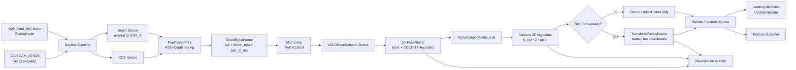

本页从**一帧 RGBD 数据如何变成业务判断结果**这一主线出发，描述 OAK RGBD 新链路中的端到端数据流：DepthAI 采集 RGB 与深度、主循环获取最新帧、YOLOv8 Pose 生成 2D 人体关键点、深度图与相机内参把关键点反投影到 3D、床面坐标系可用时再转换到蹦床坐标系，最后将髋点轨迹与姿态角度送入落点检测和姿态分类逻辑。本文只覆盖整体流向与模块协作边界；模型细节、同步细节、平面拟合数学和单项业务算法可继续阅读文末链接。Sources: [get_pose_oak_rgbd.cpp](get_pose_oak_rgbd.cpp#L602-L689), [get_pose_oak_rgbd.cpp](get_pose_oak_rgbd.cpp#L731-L1003)

## 架构假设与代码验证结论

初始架构假设是：程序采用**采集线程生产最新 RGBD 帧，主线程消费最新帧并串行完成推理、深度融合、坐标转换和业务判断**的模式。代码验证后，这一假设成立：`OakRgbdCapture::Start()` 启动独立 `CaptureLoop` 工作线程，`TryGetLatest()` 在主循环中以非阻塞方式取出最近发布的 `TimedRgbdFrame`；主循环拿到 `bgr` 与 `depth_mm` 后调用 `pose_detector.Detect()`，再对每个 2D 关键点做深度采样和 3D 反投影，最后调用 `depth_region.UpdateHipData()` 与姿态分类器。Sources: [app/oak_rgbd_capture.cpp](app/oak_rgbd_capture.cpp#L206-L244), [app/oak_rgbd_capture.cpp](app/oak_rgbd_capture.cpp#L271-L278), [get_pose_oak_rgbd.cpp](get_pose_oak_rgbd.cpp#L731-L753), [get_pose_oak_rgbd.cpp](get_pose_oak_rgbd.cpp#L840-L1003)

下面的 Mermaid 图展示的是**运行时数据关系**，不是类继承关系：左侧是 OAK/DepthAI 采集链路，中间是主循环中的推理与 3D 融合，右侧是业务状态更新与可视化输出。Sources: [app/oak_rgbd_capture.cpp](app/oak_rgbd_capture.cpp#L280-L390), [app/oak_rgbd_capture.cpp](app/oak_rgbd_capture.cpp#L395-L456), [get_pose_oak_rgbd.cpp](get_pose_oak_rgbd.cpp#L731-L840), [get_pose_oak_rgbd.cpp](get_pose_oak_rgbd.cpp#L983-L1039)

## 阶段一：相机采集把硬件帧规整为 TimedRgbdFrame

采集链路的输入硬件在启动日志与配置中被固定为 OAK-FFC-4P RVC2，其中 CAM_A 输出 RGB，CAM_B/C 参与双目深度；主程序把 RGB 与 mono 分辨率都配置为 `640x400`，帧率为 `50.0f`，RGB-Depth 配对阈值为 `5.0 ms`，并启用 StereoDepth 的 `subpixel` 和后处理开关。这个配置决定了后续主循环看到的数据形态：RGB 是 CAM_A BGR 图像，深度图是与 CAM_A 对齐的 `CV_16UC1` 毫米深度图。Sources: [get_pose_oak_rgbd.cpp](get_pose_oak_rgbd.cpp#L613-L638), [app/oak_rgbd_capture.cpp](app/oak_rgbd_capture.cpp#L334-L388), [app/oak_rgbd_capture.cpp](app/oak_rgbd_capture.cpp#L433-L455)

采集线程在 `CaptureLoop()` 中读取 DepthAI 标定，构造 CAM_A 的相机内参矩阵 `K_` 与逆矩阵 `K_inv_`，随后创建 RGB、左目、右目相机节点和 `StereoDepth` 节点；深度输出通过 `rgb_out->link(stereo->inputAlignTo)` 对齐到 CAM_A，并经过 host 侧 `ImageFilters` 后进入深度输出队列。Sources: [app/oak_rgbd_capture.cpp](app/oak_rgbd_capture.cpp#L293-L306), [app/oak_rgbd_capture.cpp](app/oak_rgbd_capture.cpp#L308-L377)

采集线程不是把每一帧都交给主线程排队处理，而是维护 RGB 与 depth 两个缓冲，使用 `PopClosestPair()` 在时间阈值内匹配最近的 RGB 与深度消息；匹配成功后将 RGB 转为 BGR、深度转为 `CV_16UC1`，检查尺寸与类型，再通过 `PublishFrame()` 覆盖式发布为最新帧。这个设计使主循环消费的是**最新一对有效 RGBD 帧**，而不是历史帧积压队列。Sources: [app/oak_rgbd_capture.cpp](app/oak_rgbd_capture.cpp#L43-L97), [app/oak_rgbd_capture.cpp](app/oak_rgbd_capture.cpp#L395-L456), [app/oak_rgbd_capture.cpp](app/oak_rgbd_capture.cpp#L271-L278)

| 数据项 | 产生位置 | 类型/语义 | 后续用途 |
|---|---|---|---|
| `bgr` | `Nv12ToBgr()` 后写入 `TimedRgbdFrame` | CAM_A RGB 转 BGR 图像 | YOLO Pose 推理与窗口可视化 |
| `depth_mm` | `DepthToU16()` 后写入 `TimedRgbdFrame` | 与 CAM_A 对齐的 `CV_16UC1` 毫米深度 | 关键点深度采样与反投影 |
| `timestamp_sec` | RGB 消息时间戳 | 当前 RGB 帧时间 | 主循环保留帧时间信息 |
| `pair_dt_ms` | RGB/Depth 最近邻配对误差 | 同步误差毫秒值 | 窗口叠加显示 `Sync dt` |
| `K` / `K_inv` | DepthAI 标定读取 | CAM_A 内参与逆矩阵 | 像素点到相机坐标反投影 |

Sources: [app/oak_rgbd_capture.cpp](app/oak_rgbd_capture.cpp#L99-L159), [app/oak_rgbd_capture.cpp](app/oak_rgbd_capture.cpp#L233-L254), [app/oak_rgbd_capture.cpp](app/oak_rgbd_capture.cpp#L450-L455), [get_pose_oak_rgbd.cpp](get_pose_oak_rgbd.cpp#L646-L659), [get_pose_oak_rgbd.cpp](get_pose_oak_rgbd.cpp#L742-L747)

## 阶段二：主循环只在拿到新 RGBD 帧时推进计算

主循环通过 `oak_capture.TryGetLatest(rgbd)` 拉取最新帧；如果没有新帧，仅处理键盘退出并继续等待。拿到帧后，代码将 `rgbd.bgr` 赋给 `left_image`，将 `rgbd.depth_mm` 赋给 `depth_data`，并把 `rgbd.pair_dt_ms` 保存为 `depth_sync_error_ms`，用于后续叠加显示。Sources: [get_pose_oak_rgbd.cpp](get_pose_oak_rgbd.cpp#L731-L747)

主循环的核心计算从 `left_image` 非空开始：记录推理开始时间，调用 `pose_detector.Detect(left_image)` 得到 `std::vector<PoseResult>`，再把推理耗时加入性能统计。这里的主流程是串行的：每帧先完成 2D 姿态检测，再进入可视化与深度融合阶段。Sources: [get_pose_oak_rgbd.cpp](get_pose_oak_rgbd.cpp#L748-L759)

检测结果首先服务于 2D 可视化：程序克隆 RGB 图像为 `display`，调用 `DrawPoses()` 绘制人体框、关键点和骨架，调用 `DrawPoseInfo()` 绘制检测信息，并叠加 FPS、推理耗时、RGB-Depth 同步误差和检测人数。Sources: [get_pose_oak_rgbd.cpp](get_pose_oak_rgbd.cpp#L787-L823)

## 阶段三：YOLOv8 Pose 输出 2D 人体结构

`YOLOPoseDetector` 构造时记录模型路径、输入尺寸、置信度阈值、NMS IoU 阈值和是否使用 CUDA；如果启用 CUDA，构造函数尝试追加 CUDA Execution Provider，失败时回落到 CPU。主程序实例化检测器时使用 `model_path`、`640` 输入尺寸、`0.5f` 检测阈值、`0.45f` NMS 阈值，并传入 `true` 启用 CUDA。Sources: [yolo_pose_detector.cpp](yolo_pose_detector.cpp#L10-L47), [get_pose_oak_rgbd.cpp](get_pose_oak_rgbd.cpp#L661-L668)

检测器初始化阶段创建 ONNX Runtime Session，读取并打印输入输出节点信息，要求模型只有一个输入和一个输出。推理阶段先执行 `Preprocess()`，再创建 `{1, 3, input_size_, input_size_}` 输入张量并调用 `session_->Run()`，最后把输出交给 `Postprocess()`。Sources: [yolo_pose_detector.cpp](yolo_pose_detector.cpp#L53-L117), [yolo_pose_detector.cpp](yolo_pose_detector.cpp#L170-L212)

预处理采用 letterbox 等比例缩放：根据原图宽高计算 `scale_factor_`，缩放后用常量 `114` padding 到正方形输入，再把 BGR 转 RGB、归一化到 `[0,1]`，并从 HWC 重排为 CHW。这个步骤解释了为什么后处理必须用 `pad_w_`、`pad_h_` 和 `scale_factor_` 把模型坐标映射回原始 RGB 图。Sources: [yolo_pose_detector.cpp](yolo_pose_detector.cpp#L119-L168), [yolo_pose_detector.cpp](yolo_pose_detector.cpp#L348-L380)

后处理明确按 YOLOv8-pose 输出 `[1, 56, 8400]` 解析：`56 = 4 bbox + 1 confidence + 17*3 keypoints`。代码先转置输出方便访问，再按检测置信度过滤 proposal，解析 bbox 与 17 个关键点，执行 NMS，最后把 bbox 和关键点坐标从 letterbox 输入空间回映射到原始图像尺寸。Sources: [yolo_pose_detector.cpp](yolo_pose_detector.cpp#L215-L289), [yolo_pose_detector.cpp](yolo_pose_detector.cpp#L292-L328), [yolo_pose_detector.cpp](yolo_pose_detector.cpp#L348-L380)

## 阶段四：深度融合把 2D 关键点提升为相机 3D 点

深度融合阶段先准备 `pose_3d_infos`，并检查 `DepthRegion` 的床面坐标系是否就绪；如果就绪，读取 `R_bed_cam` 和床面原点。随后，只有在 `depth_data` 非空且存在检测姿态时，才遍历每个人和每个关键点进行 3D 计算。Sources: [get_pose_oak_rgbd.cpp](get_pose_oak_rgbd.cpp#L840-L856)

每个关键点的 3D 反投影必须同时满足三个条件：关键点置信度不低于 `0.3f`，像素坐标落在深度图范围内，且 `RobustDepthMedianU16()` 能在半径 `r=3` 的窗口内得到有效深度。有效深度过滤规则是跳过 `0` 和 `>=10000` 的深度值，并要求至少 6 个有效采样，再取中位数作为该关键点的 `Z`。Sources: [get_pose_oak_rgbd.cpp](get_pose_oak_rgbd.cpp#L863-L879), [app/depth_utils.cpp](app/depth_utils.cpp#L6-L28)

相机坐标计算采用标准针孔反投影形式：构造齐次像素向量 `[px, py, 1]^T`，用 `cv_in_left_inv * Z * kp_img_cor` 得到相机坐标点 `cam_pt`，并写入 `info.kp_cam[k]` 与 `info.kp_valid[k]`；当床面坐标系就绪时，代码还会调用 `depth_region.TransformToNewFrame(cam_pt)` 得到蹦床坐标系下的 `kp_bed[k]`。Sources: [get_pose_oak_rgbd.cpp](get_pose_oak_rgbd.cpp#L881-L897)

髋点是后续业务判断的关键中间量：如果左右髋都有效，骨盆点取二者相机坐标平均值；如果只有一侧有效，则使用有效一侧。床面坐标系就绪时，同一个骨盆点还会转换为 `pelvis_bed`，并封装为 `DepthRegion::HipInfo`，其中 `camera_pos` 保存相机坐标，`new_frame_pos` 保存新坐标系坐标。Sources: [get_pose_oak_rgbd.cpp](get_pose_oak_rgbd.cpp#L899-L927)

如果床面坐标系已就绪，代码还会把每个有效关键点的床面坐标写回 `poses[p].keypoints[k].pos3d`。这意味着 `PoseResult` 在 YOLO 检测后仍会被主循环补充 3D 结果，形成 2D 检测结果与 3D 空间结果共存的数据对象。Sources: [yolo_pose_detector.h](yolo_pose_detector.h#L36-L58), [get_pose_oak_rgbd.cpp](get_pose_oak_rgbd.cpp#L929-L940)

## 阶段五：选择跟踪目标并构建业务输入

当床面坐标系可用且存在 3D 姿态信息时，主循环会选择一个跟踪对象：如果之前没有跟踪对象，选择第一个有效骨盆点；否则计算每个候选骨盆点与上一帧跟踪骨盆点的三维距离平方，选择距离最近者。这一策略把多人体检测结果收敛为一个当前业务目标。Sources: [get_pose_oak_rgbd.cpp](get_pose_oak_rgbd.cpp#L943-L959)

跟踪目标选定后，程序调用 `BuildBodyFrameFromPose()` 基于髋与肩关键点构建人体坐标系。该函数在床面坐标下定义 `y_body` 为骨盆中点指向肩部中点，`x_body` 为右侧到左侧的横向方向，`z_body` 为 `x_body × y_body`，并通过 Gram-Schmidt 正交化得到旋转矩阵；随后计算人体坐标系在相机下的旋转、相对旋转、四元数和欧拉角。Sources: [get_pose_oak_rgbd.cpp](get_pose_oak_rgbd.cpp#L509-L599), [get_pose_oak_rgbd.cpp](get_pose_oak_rgbd.cpp#L966-L988)

姿态度量由 `ComputePostureMetrics()` 计算：它要求左右髋和左右肩可用以构造躯干向量，再分别使用髋、膝、踝计算大腿与小腿相关角度；当左右腿都有效时取平均，否则使用有效单侧结果。主循环把 `avg_valid`、`avg_tt` 和 `avg_ts` 交给 `PostureHysteresisClassifier::Update()`，得到当前姿态标签。Sources: [get_pose_oak_rgbd.cpp](get_pose_oak_rgbd.cpp#L388-L450), [get_pose_oak_rgbd.cpp](get_pose_oak_rgbd.cpp#L983-L991)

## 阶段六：业务判断沿髋点轨迹与姿态指标更新

落点检测的数据入口是 `depth_region.UpdateHipData(hip_data_list)`。主循环在完成深度融合后，把本帧所有可用髋点组成 `hip_data_list`，再交给 `DepthRegion`；该调用被性能统计标记为 `LandingDetect` 阶段。Sources: [get_pose_oak_rgbd.cpp](get_pose_oak_rgbd.cpp#L919-L927), [get_pose_oak_rgbd.cpp](get_pose_oak_rgbd.cpp#L997-L1003)

`UpdateHipData()` 内部会处理缺失帧、稳定选择跟踪髋点，并在新坐标系可用时对 `new_frame_pos` 做 EMA 滤波；随后将滤波后的新坐标系 Z 值加入历史序列，并调用 `CheckLandingPoint()` 进行落点检测。这里的业务输入已经从“人体所有关键点”简化为“稳定跟踪的髋点三维轨迹”。Sources: [app/depth_region.h](app/depth_region.h#L603-L675)

落点检测采用局部极小值确认：`CheckLandingPoint()` 把当前帧写入缓冲，利用 Z 方向由下降转为上升的趋势发现候选极低点，并等待确认帧数；确认后 `ConfirmLandingPoint()` 在候选点附近搜索实际最小 Z，并在窗口内用 `1 / (|Z_i - Z_min| + epsilon)` 对 X、Y 做加权平均，形成最终落点记录。Sources: [app/depth_region.h](app/depth_region.h#L677-L767), [app/depth_region.h](app/depth_region.h#L769-L852)

记录落点时，`RecordLandingPoint()` 依据全局运行标志 `g_runtime_flags.record_enabled` 决定是否入库；无论是否入库，都会输出时间、新坐标系 X/Y/Z、采样窗口和已入库落点数。这说明业务判断与业务记录是解耦的：检测可以发生在 REC 关闭时，但只有 REC 开启时才进入落点列表。Sources: [app/depth_region.h](app/depth_region.h#L854-L880)

## 数据对象生命周期总览

下面的表按一帧数据从采集到业务输出的顺序列出核心对象，帮助中级开发者定位“某个值在哪一步产生、在哪一步被消费”。Sources: [app/oak_rgbd_capture.cpp](app/oak_rgbd_capture.cpp#L450-L455), [yolo_pose_detector.h](yolo_pose_detector.h#L36-L58), [get_pose_oak_rgbd.cpp](get_pose_oak_rgbd.cpp#L840-L940), [app/depth_region.h](app/depth_region.h#L529-L538)

| 阶段 | 核心对象 | 关键字段 | 生产者 | 消费者 |
|---|---|---|---|---|
| RGBD 采集 | `TimedRgbdFrame` | `bgr`, `depth_mm`, `timestamp_sec`, `pair_dt_ms` | `OakRgbdCapture::CaptureLoop()` | 主循环 |
| 2D 推理 | `PoseResult` | `bbox`, `box_confidence`, `keypoints[17]` | `YOLOPoseDetector::Detect()` | 绘制、深度融合、姿态计算 |
| 3D 融合 | `Pose3DInfo` | `kp_cam`, `kp_bed`, `kp_valid`, `pelvis_cam`, `pelvis_bed` | 主循环深度融合代码 | 跟踪、姿态指标、人体坐标系 |
| 髋点业务输入 | `DepthRegion::HipInfo` | `camera_pos`, `new_frame_pos`, `has_new_frame` | 主循环骨盆点计算 | `DepthRegion::UpdateHipData()` |
| 姿态业务输入 | `PostureMetrics` | `avg_tt`, `avg_ts`, `label` | `ComputePostureMetrics()` 与分类器 | 窗口叠加与业务状态 |
| 落点输出 | `LandingPoint` | `new_frame_x`, `new_frame_y`, `new_frame_z`, `t_ms_since_start` | `ConfirmLandingPoint()` | 落点列表、控制台、CSV 保存链路 |

Sources: [app/oak_rgbd_capture.cpp](app/oak_rgbd_capture.cpp#L450-L455), [yolo_pose_detector.h](yolo_pose_detector.h#L48-L58), [get_pose_oak_rgbd.cpp](get_pose_oak_rgbd.cpp#L41-L48), [get_pose_oak_rgbd.cpp](get_pose_oak_rgbd.cpp#L182-L193), [app/depth_region.h](app/depth_region.h#L529-L538), [app/depth_region.h](app/depth_region.h#L603-L675)

## 可视化与交互在数据流中的位置

可视化不是独立的后处理程序，而是主循环每帧数据流的一部分：RGB 图像克隆为 `display` 后，先绘制 2D 姿态与性能信息，再根据深度融合结果绘制床面坐标系、深度 ROI、人体坐标轴和人体框；鼠标回调绑定到 `"YOLO Pose - OAK CAM_A RGBD"` 窗口，用于四点 ROI 选择并驱动床面坐标系准备状态。Sources: [get_pose_oak_rgbd.cpp](get_pose_oak_rgbd.cpp#L787-L823), [get_pose_oak_rgbd.cpp](get_pose_oak_rgbd.cpp#L1034-L1169), [app/depth_region.h](app/depth_region.h#L45-L81)

交互控制也影响业务数据流：程序启动时列出 `r` 控制落点记录、`c` 清空落点缓存、`s` 保存落点 CSV、鼠标点击四角拟合床面等操作；其中鼠标 ROI 决定 `bed_ready` 是否成立，而 `bed_ready` 又决定关键点和髋点是否能进入新坐标系，从而影响落点检测是否使用床面坐标。Sources: [get_pose_oak_rgbd.cpp](get_pose_oak_rgbd.cpp#L691-L706), [get_pose_oak_rgbd.cpp](get_pose_oak_rgbd.cpp#L846-L852), [get_pose_oak_rgbd.cpp](get_pose_oak_rgbd.cpp#L894-L927), [app/depth_region.h](app/depth_region.h#L106-L130)

## 与其他页面的阅读关系

如果你要进一步深入采集层，请阅读 [OAK DepthAI 管线、RGB-Depth 配对与时间同步](15-oak-depthai-guan-xian-rgb-depth-pei-dui-yu-shi-jian-tong-bu)；如果你要理解 YOLO 输出如何从张量变成关键点，请阅读 [YOLOv8 Pose 的 ONNX Runtime 推理流程](12-yolov8-pose-de-onnx-runtime-tui-liu-cheng) 和 [Letterbox 预处理、坐标回映射与非极大值抑制](13-letterbox-yu-chu-li-zuo-biao-hui-ying-she-yu-fei-ji-da-zhi-yi-zhi)；如果你要理解从深度值到三维坐标，请阅读 [深度图单位、相机内参与像素反投影](16-shen-du-tu-dan-wei-xiang-ji-nei-can-yu-xiang-su-fan-tou-ying) 与 [鲁棒深度采样与无效深度过滤策略](17-lu-bang-shen-du-cai-yang-yu-wu-xiao-shen-du-guo-lu-ce-lue)。Sources: [app/oak_rgbd_capture.cpp](app/oak_rgbd_capture.cpp#L280-L456), [yolo_pose_detector.cpp](yolo_pose_detector.cpp#L119-L289), [get_pose_oak_rgbd.cpp](get_pose_oak_rgbd.cpp#L863-L897), [app/depth_utils.cpp](app/depth_utils.cpp#L6-L28)

如果你关注业务层，请继续阅读 [四点 ROI、RANSAC 平面拟合与床面坐标系构建](18-si-dian-roi-ransac-ping-mian-ni-he-yu-chuang-mian-zuo-biao-xi-gou-jian)、[髋点轨迹建模与落点检测状态机](21-kuan-dian-gui-ji-jian-mo-yu-luo-dian-jian-ce-zhuang-tai-ji)、[团身、屈体、直体三种基础姿态判定](22-tuan-shen-qu-ti-zhi-ti-san-chong-ji-chu-zi-tai-pan-ding) 和 [稳定性优化：EMA、滞回、同步与异常抑制](24-wen-ding-xing-you-hua-ema-zhi-hui-tong-bu-yu-yi-chang-yi-zhi)。Sources: [app/depth_region.h](app/depth_region.h#L45-L81), [app/depth_region.h](app/depth_region.h#L603-L880), [get_pose_oak_rgbd.cpp](get_pose_oak_rgbd.cpp#L388-L450), [get_pose_oak_rgbd.cpp](get_pose_oak_rgbd.cpp#L983-L991)